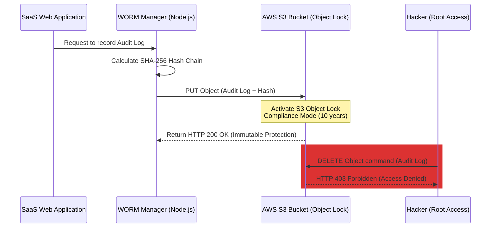

# Appendix: AWS S3 Object Lock Architecture for WORM Audit Vault
*Research document for immutable storage solutions on the cloud*
*Topic: Secure Multi-tenant SaaS Platform*

---

In a cloud production environment, storing a security immutable ledger (WORM - Write Once, Read Many) locally on a Node.js server has limitations in terms of infrastructure scalability and risks of interference if an attacker gains root access to the virtual machine (VPS/EC2). This document presents an infrastructure architecture solution using **AWS S3 Object Lock** to enforce absolute enterprise-grade immutability for the WORM Audit Vault.

---

## 1. Operating Principle of AWS S3 Object Lock

AWS S3 Object Lock allows you to store objects using the WORM model. This solution prevents the deletion or overwriting of objects for a specified retention period or indefinitely (Legal Hold).



### Selected Object Lock Protection Mode:
* **Compliance Mode (Compliance Mode):** 
  * In this mode, objects cannot be deleted or overwritten by any user, including the AWS root account.
  * The retention period cannot be shortened or disabled. This is the highest mode to meet strict financial and security standards (SEC Rule 17a-4, FINRA, ISO 27001).

---

## 2. Node.js SDK Deployment Code (AWS SDK v3)

Below is the actual Node.js module that connects and pushes immutable ledger logs to AWS S3 using SDK v3:

```typescript
import { S3Client, PutObjectCommand, GetObjectCommand } from "@aws-sdk/client-s3";
import crypto from 'crypto';

const s3Client = new S3Client({
    region: process.env.AWS_REGION || "ap-southeast-1",
    credentials: {
        accessKeyId: process.env.AWS_ACCESS_KEY_ID!,
        secretAccessKey: process.env.AWS_SECRET_ACCESS_KEY!
    }
});

const BUCKET_NAME = process.env.AWS_S3_WORM_BUCKET_NAME!;

export interface AuditPayload {
    tenantId: string;
    userId: string;
    action: string;
    tableName: string;
    details: any;
    clientIp: string;
}

/**
 * Push immutable log to AWS S3 Bucket with Object Lock enabled
 */
export async function writeImmutableLogToS3(payload: AuditPayload, previousHash: string) {
    const timestamp = new Date().toISOString();
    
    // 1. Calculate Hash Chain to protect data integrity
    const recordString = JSON.stringify(payload) + timestamp + previousHash;
    const currentHash = crypto.createHash('sha256').update(recordString).digest('hex');

    const ledgerEntry = {
        ...payload,
        timestamp,
        previous_hash: previousHash,
        current_hash: currentHash
    };

    const key = `ledger/${payload.tenantId}/${timestamp}_${currentHash.substring(0, 8)}.json`;

    // 2. Set up command to send to S3 with Object Lock metadata
    const command = new PutObjectCommand({
        Bucket: BUCKET_NAME,
        Key: key,
        Body: JSON.stringify(ledgerEntry),
        ContentType: "application/json",
        // Mandatory Content-MD5 configuration for AWS to verify file upload accuracy
        ContentMD5: crypto.createHash('md5').update(JSON.stringify(ledgerEntry)).digest('base64'),
    });

    try {
        const response = await s3Client.send(command);
        console.log(`[AWS WORM] Log written successfully to S3: ${key}`);
        return {
            key,
            currentHash,
            s3VersionId: response.VersionId
        };
    } catch (error) {
        console.error("[AWS WORM Error] Failed to write immutable log:", error);
        throw error;
    }
}
```

---

## 3. Terraform Configuration (Infrastructure as Code)

To ensure the S3 Bucket is enabled with Object Lock at the infrastructure level, here is a sample Terraform code to configure AWS resources:

```hcl
resource "aws_s3_bucket" "worm_audit_bucket" {
  bucket = "saas-secure-worm-audit-vault"

  # Mandatory Object Lock activation
  object_lock_enabled = true
}

resource "aws_s3_bucket_versioning" "worm_versioning" {
  bucket = aws_s3_bucket.worm_audit_bucket.id
  versioning_configuration {
    status = "Enabled"
  }
}

resource "aws_s3_bucket_object_lock_configuration" "worm_lock_config" {
  bucket = aws_s3_bucket.worm_audit_bucket.id

  rule {
    default_retention {
      mode = "COMPLIANCE"
      days = 3650 # Immutable retention for 10 years
    }
  }
}
```

---
*This architecture elevates the graduation project from a local experimental model to a real-world cloud infrastructure security solution that meets international auditing standards.*