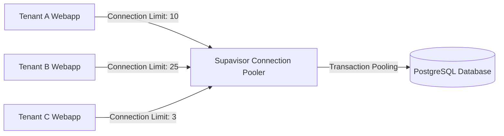

# Appendix Project: Configuring Connection Limits at the Database Tier via Supavisor
*Security Research and Database Resource Optimization Documentation*
*Topic: Secure Multi-tenant SaaS Platform*

---

In the multi-tenant SaaS model, the risk of a tenant performing too many concurrent queries or being attacked by internal DDoS, depleting the database Connection Pool (Noisy Neighbor Attack), is extremely high. In addition to limiting at the application tier (Tenant Pooler Widget), we need to configure the final checkpoint at the database tier through **Supavisor** (Supabase's intermediate connection manager). This document guides how to set up and enforce these limit parameters.

---

## 1. Operating Principle of Supavisor Connection Pooler

Supavisor acts as a Proxy in front of PostgreSQL to manage and reuse database connections. It provides two important pooling modes:
* **Session Mode:** Each client connection keeps a real Postgres connection until the client disconnects.
* **Transaction Mode (Recommended):** A Postgres connection is only assigned to the client during the transaction. After that, the Postgres connection is immediately returned to the pool to serve other queries. This helps the system support tens of thousands of concurrent connections with minimal DB RAM.



---

## 2. Configuring Connection Limits per Tenant in Supavisor

Supavisor allows dynamic connection limit division according to each Tenant's connection string (Database Users). To set this up, we configure the connection limit parameters in the Supabase database:

### Step 1: Dynamically Allocate Database Role for Tenant
Each Tenant when onboarding will be assigned a corresponding Database Role (e.g., `tenant_role_55555555`). This ensures Database-level isolation and connection partitioning.

### Step 2: Set limits using SQL commands on Postgres (Supavisor configuration)
We can run configuration commands directly on the database to limit connections for each Database User/Tenant Role:

```sql
-- 1. Limit the maximum number of connections for Tenant Free to 3 connections
ALTER ROLE tenant_role_free CONNECTION LIMIT 3;

-- 2. Limit the number of connections for Tenant Pro to 10 connections
ALTER ROLE tenant_role_pro CONNECTION LIMIT 10;

-- 3. Limit the number of connections for Tenant Enterprise to 25 connections
ALTER ROLE tenant_role_enterprise CONNECTION LIMIT 25;

-- Read back the current connection configuration to verify
SELECT rolname, rolconnlimit 
FROM pg_roles 
WHERE rolname LIKE 'tenant_role_%';
```

---

## 3. Managing Pooler Parameters via Docker Configuration (Self-Hosted Supabase)

If operating a Self-Hosted Supabase system, the Supavisor configuration is set through the `docker-compose.yml` or `supavisor.conf` file:

```yaml
services:
  supavisor:
    image: supabase/supavisor:latest
    ports:
      - "5432:5432" # Transaction Mode connection port
      - "6543:6543" # Session Mode connection port
    environment:
      # Maximum number of actual Postgres connections allowed to open
      - DATABASE_POOL_SIZE=100
      # Default mode (transaction)
      - DEFAULT_POOL_TYPE=transaction
      # Maximum wait time when the pool runs out of connection slots (ms)
      - CLIENT_LOGIN_TIMEOUT=5000
      # Enforce strict limits
      - ENFORCE_ROLE_CONNECTION_LIMITS=true
```

---

## 4. Mechanism for Automatically Dropping Idle Connections (Pruning Idle Connections)

To ensure the system does not run out of connections due to clients "hanging" idle connections, we set up a trigger to automatically clean up idle connections in PostgreSQL:

```sql
-- Set the maximum time a transaction can run idle before being dropped (5 minutes)
ALTER SYSTEM SET idle_in_transaction_session_timeout = 300000;

-- Set the maximum time a session connection can hang idle (10 minutes)
ALTER SYSTEM SET idle_session_timeout = 600000;

-- Apply configuration changes without restarting the database
SELECT pg_reload_conf();
```

---
*Configuring both tiers: Application tier (Tenant Connection Pooler) and Database tier (Supavisor Role Limit) helps the SaaS system achieve a high level of defense-in-depth, ready to handle large loads in real-world environments.*