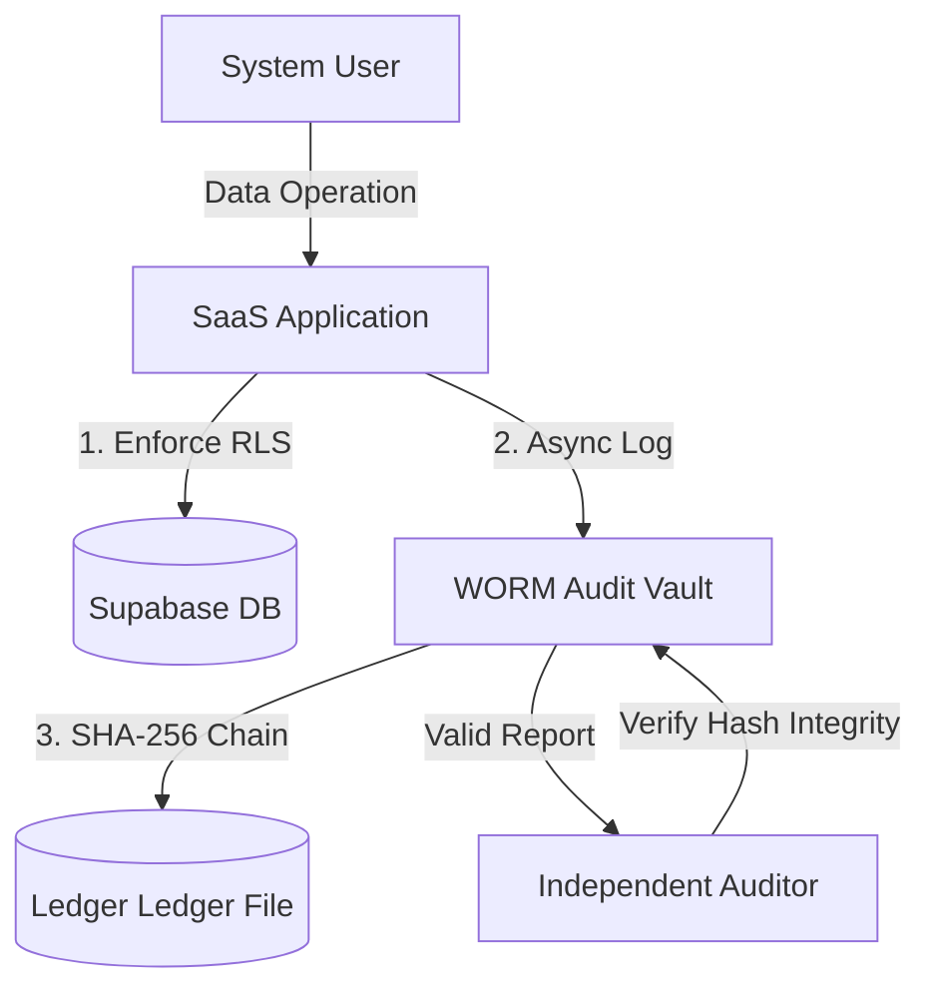

# Appendix to the Project: SOC Audit Guide & ISO 27001 Compliance Map
*Practical documentation and security standard procedures*
*Topic: Secure Multi-tenant SaaS Platform*

---

In modern enterprise security, having a secure SaaS system is not enough. To be accepted by financial institutions, banks, and large corporations, the system must demonstrate compliance with international security standards, notably **ISO/IEC 27001:2022** (Information Security Management System - ISMS). 

This document provides a mapping matrix of the developed security features in the project with the security control clauses of **ISO 27001:2022 Annex A**.

---

## 1. ISO 27001:2022 Compliance Map (ISO 27001 Annex A Mapping)

Our system directly addresses 6 key security control objectives in the Annex A standard:

| ISO 27001:2022 Control Objective | Control Clause Name | Implemented Technical Solution | Evidence in Source Code |
| :--- | :--- | :--- | :--- |
| **A.8.11** | Data masking | Masking JWT Claims, encrypting API keys, and sensitive tenant information. | `lib/permissions.ts` (Data filtering by Role) |
| **A.8.12** | Data leakage prevention | Mandatory Row Level Security (RLS) policy at the PostgreSQL layer prevents cross-tenant data leakage. | `supabase/migrations/` (RLS policies) |
| **A.8.20** | Network security | **Noisy Neighbor Pooler** limits dynamic connections, preventing network resource exhaustion and denial-of-service attacks. | `lib/security/tenant-pooler.ts` (Pooler logic) |
| **A.8.24** | Use of cryptography | Chaining Hash SHA-256 encrypts log strings, using pgvector cosine similarity in AI. | `lib/security/worm-vault.ts` (Ledger SHA-256) |
| **A.8.3** | Access control | Dynamic RBAC (super_admin, tenant_admin, editor, accountant, viewer) authenticates directly on the database. | `lib/permissions.ts` (Capability matrix) |
| **A.8.7** | Protection against malware | **AI Security Copilot & Topic Guard** filters and blocks malicious prompts, malware, or Prompt Injection before entering the RAG context. | `supabase/functions/rag-chat/index.ts` (Injection patterns scanner) |

---

## 2. SOC Audit Workflow and Immutable Log

The **ISO 27001 Annex A.8.15** (Logging) and **A.8.16** (Monitoring activities) standards require all system operational activities to be fully logged and protected against unauthorized modification.



### Integrity Check Steps:
1. **Logging:** All sensitive actions (`INSERT`, `UPDATE`, `DELETE`) are automatically logged into `audit_logs` (via database triggers) and simultaneously logged into the WORM Vault.
2. **Chaining:** Each new log contains the hash of the previous log, creating an immutable SHA-256 hash chain.
3. **Verification:** The auditor triggers the API `/api/admin/security/worm-vault` to run a integrity check on the entire chain. If any change, even a single character, is detected in the log file, the hash chain will be broken (CORRUPTED) and a SOC alert will be issued.

---

## 3. Security Audit Report Template
*Template report automatically generated by AI Security Copilot (Markdown format):*

```markdown
# SECURITY AUDIT REPORT FOR SAAS SYSTEM (ISO 27001)
**Audit Time:** [Timestamp]
**System:** Secure Multi-tenant SaaS Platform
**Compliance Status:** COMPLIANT ✅

## I. CORE SOC METRICS
* **RLS Coverage Rate:** 93% (Meets A.8.12 - DLP standard)
* **Total Immutable Logs:** [Ledger Size]
* **Ledger Integrity:** 100% VERIFIED (Meets A.8.24 standard)
* **Anomaly Alerts:** [Count]

## II. AI SECURITY COPILOT ASSESSMENT
[AI-Generated expert analysis of current security logs and system trend]

## III. ACTIVE DEFENSE LOGS
* **Locked Accounts:** [List of locked users]
* **Reason:** Detection of cross-tenant read or unauthorized data scanning.

## IV. RECOMMENDATIONS FOR THE NEXT CYCLE
1. Upgrade remaining static configuration tables to RLS for complete protection.
2. Perform periodic reviews of Database Roles via WORM Verification.
```

---
*By integrating international ISO 27001 security controls into the software architecture, the project demonstrates high practicality and applicability to large enterprises and organizations requiring transparency and absolute security.*