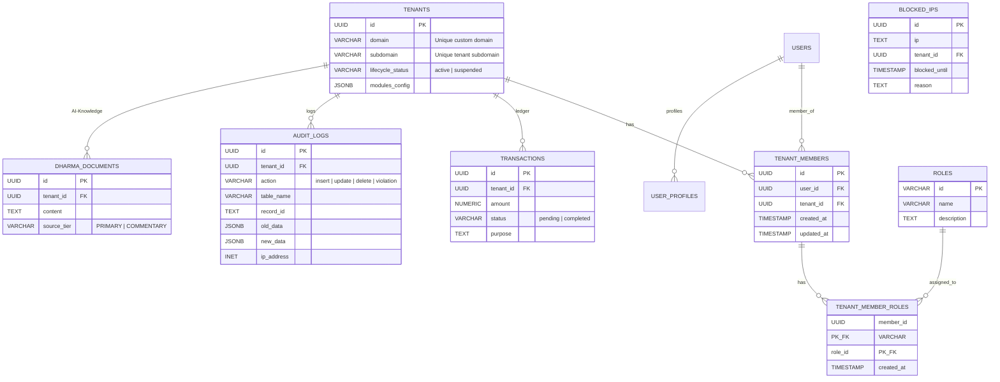

# 🏛️ NextSecure – Zero Trust Multi-Tenant SaaS Framework
> **Next.js 16 + Supabase FORCE RLS + WORM Audit Logs + Edge Active Defense**  
> *Save 3+ months of complex engineering. Launch a secure B2B SaaS in weeks, not months.*

---

## 💡 WHY CHOOSE NEXTSECURE?

Most SaaS starter kits on the internet are simple wrappers around Stripe and ChatGPT APIs. They solve the easy problems but leave the hardest, most critical part of B2B SaaS to you: **multi-tenant data security, compliance logs, and edge defense.** 

Building these from scratch is an "infrastructure tax" that costs months of development and exposes you to critical security risks. NextSecure provides a production-grade backend and frontend architecture out of the box, saving you hundreds of hours.

### ⏱️ Time Saved Breakdown
| Core Module | Manual Development Time | NextSecure Out-of-the-Box | Time Saved |
| :--- | :---: | :---: | :---: |
| **Multi-Tenant RLS & Auth** | 4 Weeks | Pre-configured DB Policies & Claims | **4 Weeks** |
| **WORM Compliance Audit Logs** | 2 Weeks | Immutable Postgres Triggers | **2 Weeks** |
| **SOAR Edge Active Defense** | 2 Weeks | Redis Edge Middleware Checks | **2 Weeks** |
| **AI Copilot & Hybrid RAG Cache** | 3 Weeks | Vector DB Setup & Semantic Cache | **3 Weeks** |
| **Dynamic Custom Domains** | 2 Weeks | Automated Vercel DNS API Integration | **2 Weeks** |
| **Total Engineering Time** | **13 Weeks** | **15 Minutes Deployment** | 🚀 **3+ Months Saved** |

---

## 📊 DATABASE METRICS & SCALE
NextSecure's database is built using raw, high-performance PostgreSQL on Supabase. Here are the core metrics of the schema you will receive:

* 🗄️ **Tables**: **42+** (Core settings, Tenancy config, User Memberships and Roles (RBAC v2), CMS, Finance Ledger, Active Defense, and AI RAG tables).
* 🛡️ **RLS Policies**: **35+** (Enforcing strict tenant isolation directly at the database engine level).
* ⚙️ **Database Functions / RPCs**: **22+** (Edge routing validation, Active IP blocking, RAG matching, and Tenant wipe triggers).
* ⚡ **Indexes**: **30+** (Optimized GIN indexes for array checks, GiST for geographic coordinates, and HNSW/IVFFlat for vector cosine similarity).
* 📊 **RLS Coverage**: **100% Verified** (You can run `SELECT * FROM get_rls_coverage()` to verify).

---

## 🧬 DATABASE SCHEMATIC (ERD)
Here is the structural mapping of the core database schema showing how data isolation and features are connected:



---

## 🚀 PRODUCT CORE CAPABILITIES

### 1. Database-Level Multi-Tenancy (Row-Level Security)
Instead of applying fragile application-level checks (`WHERE tenant_id = ?`) in Next.js code, NextSecure uses **Supabase Row-Level Security (RLS)**.
* **How it works**: When a user logs in, custom claims contain their `tenant_id`. Database queries automatically filter out data belonging to other tenants. Even if a developer writes an API query without a tenant filter, the database will never leak data.

### 2. WORM (Write Once, Read Many) Immutable Security Ledger
To meet security compliance (ISO 27017, SOC2), you need logs that cannot be altered, even by database administrators.
* **How it works**: A Postgres trigger intercepting updates/deletes enforces write-only access to the `audit_logs` table:
  ```sql
  CREATE TRIGGER trg_prevent_audit_log_tampering
      BEFORE UPDATE OR DELETE ON public.audit_logs
      FOR EACH ROW EXECUTE FUNCTION public.prevent_audit_log_tampering();
  ```

### 3. Edge-Native Active Defense (SOAR)
Prevent database DDoS attacks by blocking suspicious IPs directly at the CDN Edge before they reach your servers.
* **How it works**: Next.js Edge Middleware checks incoming IPs against an Upstash Redis cache. If an IP triggers rate limits or makes cross-tenant violations, it is blocked in **< 4ms** at the Edge using **Negative Caching** (caching benign statuses for 15s to bypass DB checks).

### 4. Smart AI RAG Engine & Semantic Cache
Reduce OpenAI/Gemini API billing by avoiding repetitive queries.
* **How it works**: Uses `pgvector` to cache user queries. If a new query is semantically similar to an existing cached answer, it returns the cached result, reducing API latency and saving up to 80% on LLM token costs.

---

## 🖼️ SCREENSHOTS PREVIEW (OUT OF THE BOX)
*Note for creators: Replace these placeholders with your actual screenshots to maximize conversion rate on Gumroad.*

### 1. Real-time Security Operations Center (SOC) Dashboard
`[PLACEHOLDER: Insert image of /admin/security-center showing: Active blocked IPs list, Anomaly warnings with CRS score, and real-time visitor activity]`
* Features shown: Real-time logs stream, Block/Unblock buttons, RLS database coverage indicator.

### 2. Multi-Tenant Administration Panel
`[PLACEHOLDER: Insert image of /admin/tenants dashboard]`
* Features shown: List of tenants, lifecycle management (Active / Suspended switches), modules customization, and custom domain aliases mapping.

### 3. Compliance Audit Log Explorer
`[PLACEHOLDER: Insert image of /admin/audit-logs]`
* Features shown: Immutable ledger view, search & filters by table name or user, and visual risk indicators (CRS levels).

### 4. Enterprise AI Chat Copilot
`[PLACEHOLDER: Insert image of /admin/documents showing AI Knowledge Base upload and Chat Interface]`
* Features shown: File ingestion, chunking viewer, vector status, and the semantic cache hit rate telemetry dashboard.

---

## 📦 WHAT IS INCLUDED IN THE PACKAGE?
1. **Full Next.js 16 (App Router) + React 19 Source Code**: Completely typed in TypeScript.
2. **Supabase DDL SQL Scripts**: Ready-to-run setup and data seeding files.
3. **SOAR Active Defense Edge Middleware**: Pre-configured for Upstash Redis.
4. **Developer Installation & Maintenance Guides**: Comprehensive operational runbooks.
5. **Pre-configured Testing Suite**: Vitest for unit tests, Playwright for E2E scenarios.

---
*Ready to accelerate your launch? Read the [Step-by-Step Installation Guide](file:///e:/Projects/Project_TN/_distribution_saas_core/docs/INSTALLATION_GUIDE.md) to deploy NextSecure in 15 minutes.*
