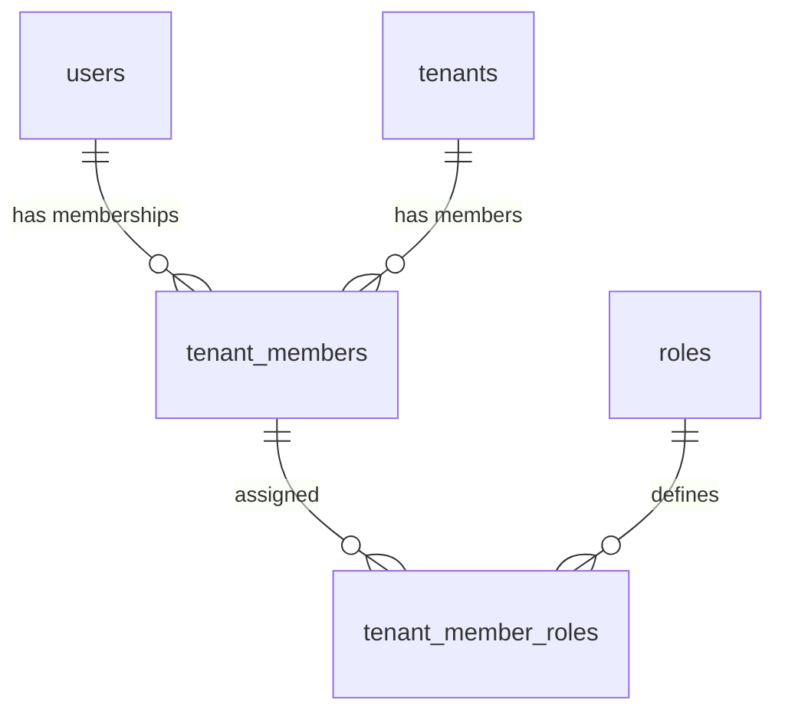

# 🏛️ B2B SaaS Security & Tenant Isolation Core - Integration Guide

This guide details the core infrastructure architecture of the starter kit. It explains how to integrate and scale the multi-tenant routing, Row-Level Security (RLS) with RBAC v2, Write-Once Read-Many (WORM) audit logs, and Edge Active Defense.

---

## 1. Multi-Tenant Domain Routing (Next.js Edge Middleware)

The framework maps custom domains (`client.com`) and wildcards (`*.yourdomain.com`) to specific tenant paths dynamically using Next.js Edge Middleware.

### How it works:
1. **Hostname Resolution:** When a request arrives, the Middleware resolves the hostname.
2. **Edge Cache Lookup:** The Middleware queries Upstash Redis (Edge Cache) to check if the hostname maps to an active tenant.
3. **Internal Rewrite:** If it does, the Middleware internally rewrites the request from `/some-path` to `/[hostname]/some-path` without altering the browser URL.
4. **Supabase Fallback:** If the hostname does not exist in Redis, it queries the Supabase REST API as a fallback and populates the Redis cache (TTL 10 min).
5. **Suspension Safeguard:** If the tenant is suspended, it returns a `403 Forbidden` with a custom lockdown HTML page.

### Middleware Rewrite Logic:
```typescript
// middleware.ts
const targetPath = pathname; // Resolved pathname with locale
const response = NextResponse.rewrite(new URL(`/${hostname}${targetPath}${search}`, request.url));
return response;
```

---

## 2. Row-Level Security (RLS) & RBAC v2 (Membership / Role Split)

To guarantee strict isolation and enterprise-grade permission management, the starter kit implements a full split between user profiles, tenant memberships, and roles.

### 2.1 Database Relationships
- `public.roles`: Lookup table for all available roles in the system (`super_admin`, `tenant_admin`, etc.).
- `public.tenant_members`: Establishes membership of a user (`user_id`) in a tenant branch (`tenant_id`). If `tenant_id` is `NULL`, the membership is global (e.g. system administrators).
- `public.tenant_member_roles`: Junction table mapping memberships to roles. A member can hold multiple roles dynamically.



### 2.2 Database Helper Functions
We define Security Definer functions in PostgreSQL to safely extract session parameters and check active permissions. All functions are secured with `SET search_path = public, pg_temp` to prevent search_path hijacking attacks:

```sql
-- Get current user's primary tenant role
CREATE OR REPLACE FUNCTION public.get_current_user_role()
RETURNS VARCHAR AS $$
    SELECT r.role_id 
    FROM public.tenant_member_roles r
    JOIN public.tenant_members m ON r.member_id = m.id
    WHERE m.user_id = auth.uid() 
    LIMIT 1;
$$ LANGUAGE sql SECURITY DEFINER STABLE SET search_path = public, pg_temp;

-- Get current user's active tenant ID
CREATE OR REPLACE FUNCTION public.get_current_tenant_id()
RETURNS UUID AS $$
    SELECT tenant_id 
    FROM public.tenant_members
    WHERE user_id = auth.uid() AND tenant_id IS NOT NULL
    LIMIT 1;
$$ LANGUAGE sql SECURITY DEFINER STABLE SET search_path = public, pg_temp;
```

### 2.3 Dynamic Permission Engine
Access policies check user permissions dynamically against the role-permission matrix:

```sql
-- Check permission for a specific tenant scope
SELECT public.has_permission_for_tenant(
    p_tenant_id := 'tenant-uuid',
    p_resource := 'settings',
    p_action := 'update'
);
```

---

## 3. WORM (Write Once, Read Many) Audit Logs

To meet SOC2 and ISO 27001 requirements, the audit log must be tamper-proof. The system enforces write-only access on the `audit_logs` table via a Postgres trigger.

### Trigger Implementation:
```sql
CREATE OR REPLACE FUNCTION public.prevent_audit_log_tampering()
RETURNS TRIGGER 
LANGUAGE plpgsql
SECURITY DEFINER
SET search_path = public, pg_temp
AS $$
BEGIN
    RAISE EXCEPTION 'MANDATORY AUDIT COMPLIANCE: Audit logs are immutable and cannot be updated or deleted.';
    RETURN NULL;
END;
$$;

CREATE TRIGGER trg_prevent_audit_log_tampering
    BEFORE UPDATE OR DELETE ON public.audit_logs
    FOR EACH ROW EXECUTE FUNCTION public.prevent_audit_log_tampering();
```
*Effect:* Any attempt to call `UPDATE` or `DELETE` on the `audit_logs` table throws a database exception, even if executed by the `service_role` root API key.

---

## 4. Edge Active Defense

Suspicious IPs are blocked at the CDN edge before they put load on your database servers.

### 4.1 Negative Caching
To prevent DB spamming during DDoS, the Middleware checks Upstash Redis first.
*   **Safe IP:** Cached as `false` in Redis for 15 seconds. The Middleware bypasses database lookups.
-   **Blocked IP:** Cached with a blocking reason and expiration time. The request is immediately rejected at the edge.

### 4.2 Sliding-Window Rate Limiting
A Database RPC tracks hits in a sliding window. If an IP exceeds threshold rules, a Telegram security alert is sent, and the IP is added to the `blocked_ips` table.

```sql
SELECT public.check_rate_limit(
    p_action := 'api_access',
    p_ip := '1.2.3.4',
    p_max_hits := 100,
    p_tenant_id := 'tenant-uuid',
    p_user_id := 'user-email',
    p_window_seconds := 60
);
```

---

## 5. Developer Guide: How to Add a New B2B Table

Follow these steps to add a new tenant-isolated table that integrates with the core security structure.

### Step 1: Create the Table with `tenant_id`
Ensure your table has a foreign key to `public.tenants`.
```sql
CREATE TABLE public.tasks (
    id UUID PRIMARY KEY DEFAULT extensions.uuid_generate_v4(),
    title TEXT NOT NULL,
    description TEXT,
    tenant_id UUID REFERENCES public.tenants(id) ON DELETE CASCADE NOT NULL,
    created_at TIMESTAMP WITH TIME ZONE DEFAULT NOW() NOT NULL
);
```

### Step 2: Establish B-Tree Index on `tenant_id`
*Important:* If you do not index the foreign key, PostgreSQL will execute a Sequential Scan on every RLS evaluation. As data size grows, CPU usage will spike to 100%.
```sql
CREATE INDEX idx_tasks_tenant ON public.tasks (tenant_id);
```

### Step 3: Auto-Inject `tenant_id` using Database Trigger
To prevent developer mistakes (forgetting to supply `tenant_id` in Next.js Server Actions), add a trigger that automatically injects the tenant ID from the active session.

```sql
-- 1. Helper function
CREATE OR REPLACE FUNCTION public.auto_set_tenant_id()
RETURNS TRIGGER AS $$
BEGIN
    IF NEW.tenant_id IS NOT NULL THEN
        RETURN NEW;
    END IF;
    
    NEW.tenant_id := public.get_current_tenant_id();
    RETURN NEW;
END;
$$ LANGUAGE plpgsql SECURITY DEFINER SET search_path = public, pg_temp;

-- 2. Bind trigger
CREATE TRIGGER trg_ensure_tasks_tenant_id
    BEFORE INSERT ON public.tasks
    FOR EACH ROW EXECUTE FUNCTION public.auto_set_tenant_id();
```

### Step 4: Enable RLS and Configure Security Policies
Apply `FORCE ROW LEVEL SECURITY` to prevent table owners or developers from bypassing tenant isolation. Use `has_permission_for_tenant` to check for active privileges.

```sql
-- Enable and Force RLS
ALTER TABLE public.tasks ENABLE ROW LEVEL SECURITY;
ALTER TABLE public.tasks FORCE ROW LEVEL SECURITY;

-- Allow select/read to members of the same tenant with read permission
CREATE POLICY "Tenant read tasks" ON public.tasks
    FOR SELECT USING (
        tenant_id IS NOT NULL AND public.has_permission_for_tenant(tenant_id, 'tasks', 'read')
    );

-- Allow modification to members of the same tenant with update permission
CREATE POLICY "Tenant write tasks" ON public.tasks
    FOR ALL USING (
        tenant_id IS NOT NULL AND public.has_permission_for_tenant(tenant_id, 'tasks', 'update')
    );
```

### Step 5: Test RLS Policy Coverage
Execute this query in your SQL editor to confirm that your new table is 100% protected:
```sql
SELECT * FROM public.get_rls_coverage();
```
*Result:* Returns the percentage of protected tables in the public schema. It should always display `100.00%`.
