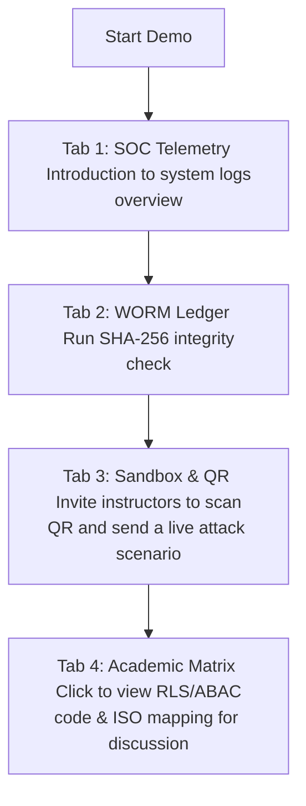

# Cyber SOC Dashboard Design Philosophy (SOC UX Design Philosophy)

This document records all the design principles, grid layouts, and visual hierarchies applied in the Security Operations Center (SOC) management page. This document serves as a scientific proof of optimizing user experience (UX) in specialized information security monitoring systems, directly serving the reporting and defense of the TenantShield platform.

---

## 1. Core Principle: De-cluttering

In enterprise security monitoring systems, high information density often confuses SOC engineers. The solution is to apply a **Maximum Functional Partitioning** design model through three pillars:

### Pillar 1: Spatial Partitioning using Premium Tabbed Interface
Instead of stacking all features on a long scrolling page, the interface is divided into **4 independent thematic zones** through a smooth Grid navigation bar:

| Zone (Tab) | Grid Layout | UX Role & Representation |
|---|---|---|
| **Tab 1: Real-time SOC Monitoring** | Asymmetric grid `1/3` (Left) + `2/3` (Right) | **Left:** Quickly displays emergency status information (Anomaly Alerts, IP Blocklist). **Right:** Explorer log details with pagination for easy system behavior tracking. |
| **Tab 2: WORM Ledger** | Focused frame `max-w-5xl mx-auto` | Completely isolates the surrounding space for SOC engineers to focus on cryptographic hash chain SHA-256 anti-tampering verification. |
| **Tab 3: Sandbox Simulation** | Balanced grid `1/2` (Left) + `1/2` (Right) | **Left:** Threat Simulator and Rate Limits control panel. **Right:** Supavisor Connection Pooler widget. Supports visual comparison of attack impact on connection resources. |
| **Tab 4: Academic Matrix** | Cyberpunk grid `5/12` (Left) + `7/12` (Right) | **Left:** 4-tier Zero Trust protection stacked vertically. **Right:** Glassmorphic card displays code and ISO mapping. Allows for quick selection. |

---

### Pillar 2: Reducing Clutter with a Dedicated Color Palette (SecOps Palette)
The system completely eliminates unnecessary color gradients or chaotic color schemes:
* **Dark Unix-like Background:** Uses a dark color scheme (`slate-900`, `slate-950`) combined with a glassy effect (Glassmorphism) to create a sense of depth in a real SOC operations room.
* **Severity-based Color Coding:** Colors are used as technical messages rather than decorative purposes:
  * **Emerald Green (`#10b981`):** Safe state, successful RLS isolation.
  * **Amber (`#f59e0b`):** Monitoring state, custom JWT claims identification.
  * **Blue (`#3b82f6`):** Audit state, Edge Security network control.
  * **Rose Red (`#f43f5e`):** Alert state, Honeypot trap or ABAC policy violation.
* **Monospace Typography:** Code snippets, IP addresses, and risk scores are displayed in monospace fonts (`JetBrains Mono` / `Roboto Mono`) to increase reading speed and data recognition for SOC engineers.

---

### Pillar 3: Smooth Micro-animations
* Tab switching is integrated with a smooth Slide-in animation from the bottom using Tailwind CSS.
* **Attack Flow Map SVG:** Uses dynamic vector animation to simulate data flow through each checkpoint. The blocked layer will flash a red neon border, creating a vivid and direct visual feedback effect.

---

## 2. Demo Scenario for TenantShield Enterprise Core Presentation

This interface layout is specially optimized to help you fully control the demo time and scenario:

1. **Step 1 (Introduction):** Open **Tab 1** to present an overview of the system's real-time log monitoring and risk alerts.
2. **Step 2 (Security Demonstration):** Open **Tab 2**, click the "Verify Ledger" button to demonstrate the ability to detect log tampering using a blockchain algorithm.
3. **Step 3 (Live Fire Exercise):** Open **Tab 3**, display the dynamic QR code on the projector. Invite instructors to scan the QR code with their phones and launch a live attack. The entire audience will observe the moving dot on the **Attack Flow Map**, hear the Vietnamese AI voice from the computer speakers, and see the IP being blocked instantly on the board and instructors' phones.
4. **Step 4 (Discussion):** Open **Tab 4** when instructors ask about data isolation algorithms. You can click on the corresponding security layer to display the PostgreSQL RLS, JWT, and ABAC trigger code cleanly on the screen.

---
*Cyber SOC Dashboard Design Philosophy Report - TenantShield Enterprise Core*